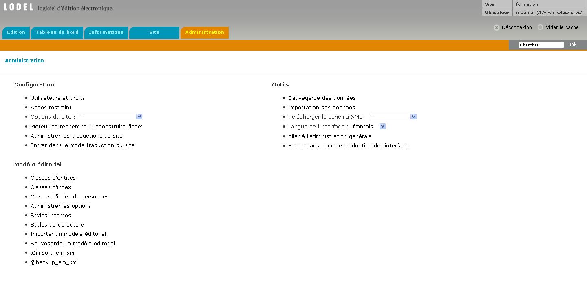
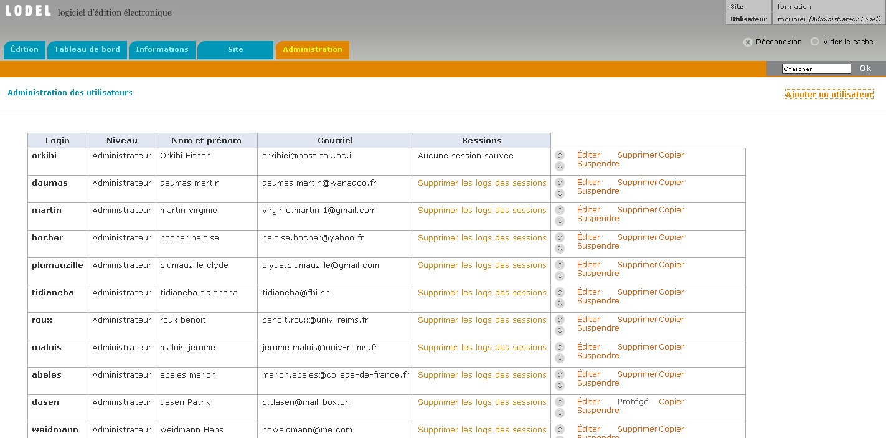
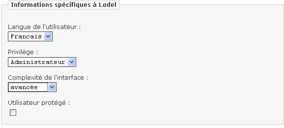
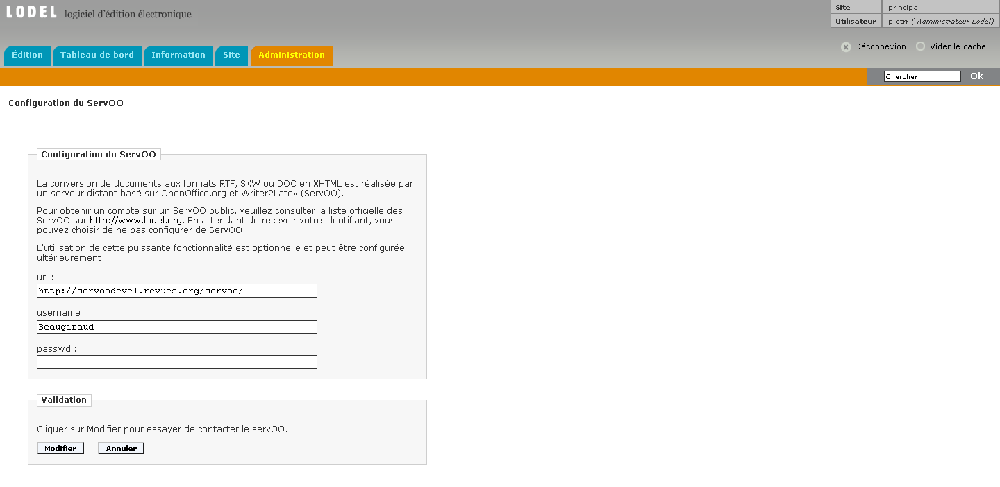

L’essentiel des fonctions de configuration d’un site Lodel est regroupé sous l’onglet « Administration ». Seul l’administrateur,
et pour certaines fonctions l’administrateur Lodel, peut utiliser cette page.

**Onglet  d’administration du site dans l’interface d’édition**

Elle est divisée en trois blocs fonctionnels. Seules les fonctions les plus importantes sont décrites dans ce chapitre.

------------------------------------------------------

## BLOC DE FONCTIONS "CONFIGURATION"

##### ADMINISTRATION DES UTILISATEURS

On trouve en particulier dans ce bloc, les fonctions de création et d’administration des utilisateurs du site. Ces fonctions sont accessibles aux administrateurs et à l’administrateur Lodel. Celui-ci peut donc visualiser sur une page l’ensemble des utilisateurs inscrits sur le site, avec leur niveau de droits, et en créer de nouveaux en leur attribuant login et mot de passe. L’utilisateur pourra venir ensuite modifier ses propres données personnelles et compléter la description de son identité lors de ses prochaines visites dans l’interface d’édition.

Il est aussi possible pour l’administrateur de changer le niveau de droit des autres utilisateurs, ainsi que de suspendre ou détruire leur compte.

**Edition des comptes utilisateurs**

Lorsqu’on crée un compte utilisateur, il faut lui attribuer un statut particulier : visiteur, rédacteur, éditeur, administrateur, selon l’importance des droits ou « privilèges » qu’on veut lui accorder. Le menu « complexité de l’interface » permet de faire apparaître ou disparaître pour ce compte différents éléments de l’interface. Il permet donc d’offrir une interface simplifiée à l’utilisateur. Attention, cette possibilité peut entraîner des confusions, elle doit être utilisée à bon escient. Dans le doute, il est préférable de laisser le niveau de complexité de l’interface sur « avancée » ; ce qui signifie que l’utilisateur pourra visualiser tous les éléments de l’interface.

**Edition d’un utilisateur**

#### ACCÈS RESTREINT

L’entrée « Accès restreint », permet de créer des comptes abonnés pour des personnes que l’on souhaite autoriser à consulter le texte intégral de documents en publication différée. La procédure de création de comptes en accès restreint est sensiblement la même que pour la création d’utilisateurs, à cette différence près qu’on définit pour les comptes en accès restreint une « date d’expiration » correspondant à  la date normale d’expiration de l’abonnement.

Attention : pour fonctionner, l’accès restreint doit être pris en charge au niveau de la maquette.

#### OPTIONS DU SITE

Le menu déroulant « Options du site » qui suit est sans aucun doute le plus important du bloc. Il permet en effet de définir plusieurs options de fonctionnement sur le site :

« Métadonnées du site » permet de fournir toutes les informations relatives au site : son titre, son sous-titre, son descriptif, le nom de son ou ses responsables, son issn le cas échéant. Il est très important de remplir le plus précisément possible chacun de ces champs car les informations qu’ils contiennent sont utilisées à divers endroits par Lodel, en particulier pour transmettre les métadonnées du site aux moteurs d’indexation.

**Page de métadonnées du site**

« Servoo » donne accès à la page de configuration qui doit être remplie avant que toute opération de conversion de fichier puisse être effectuée. C’est à ce niveau en effet que l’on renseigne l’adresse et les données de connexion permettant à Lodel de se connecter au serveur Servoo pour lui envoyer les fichiers à convertir. Il suffit de suivre les instructions à l’écran pour configurer correctement cette option.

**Configuration du Servoo**

----------------------------------------------------------

### BLOC DE FONCTIONS "MODÈLE ÉDITORIAL"

Ce bloc donne accès à toutes les fonctions de modification du modèle éditorial. Cette opération fait l’objet d’un chapitre particulier dans la documentation à destination du webmestre.

----------------------------------------------------------

### BLOC DE FONCTIONS "OUTILS"

Ce bloc donne accès à des fonctions de sauvegarde des données du site et de restauration d’une base de données sauvegardée. Ces fonctions sont accessibles au seul administrateur Lodel et sont critiques : la fonction de restauration d’une base sauvegardée est en effet irréversible et entraîne l’écrasement définitif des données présentes sur le site.

« Aller à l’administration générale » conduit vers une page de gestion technique de l’installation de Lodel sur le serveur. Le logiciel est en effet capable de gérer plusieurs sites Lodel à partir d’une seule installation. Cette page permet de gérer ces différents sites, d’administrer les utilisateurs ou de faire une sauvegarde générale de l’ensemble de l’installation.

----------------------------------------------------------

### LES FONCTIONS DE TRADUCTION

Lodel possède depuis la version 0.8 des fonctions permettant de gérer plusieurs langues de travail et de publication sur un seul site. Dans le bloc « Outils », se trouvent les entrées permettant de gérer les traductions de l’interface d’édition ; dans le bloc « Configuration », les fonctions de traduction des intitulés de navigation sur le site. Dans ce dernier cas, il faut évidemment que la maquette du site exploite le système de traduction des intitulés. Un prochain chapitre de la documentation traitera en détail des la mise en place du multilinguisme sur un site Lodel.

#### Droits d'auteur

© tous droits réservés
