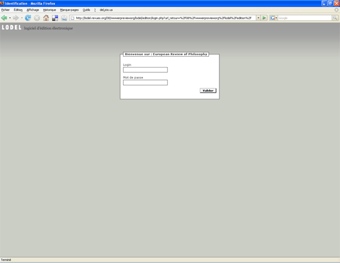
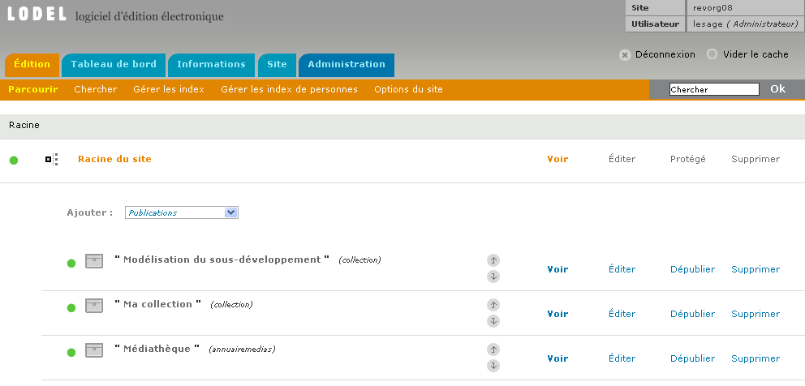
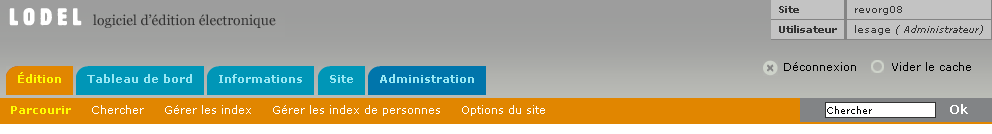
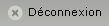
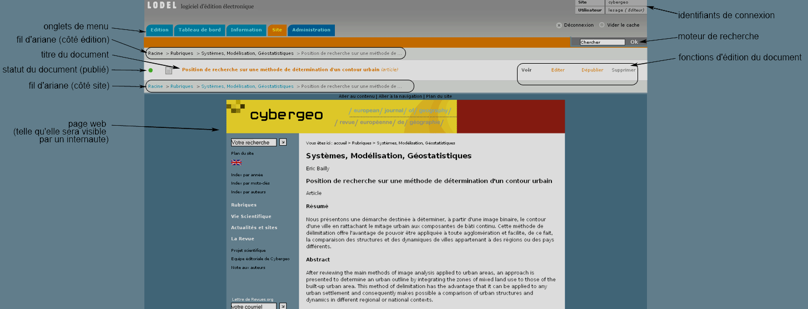
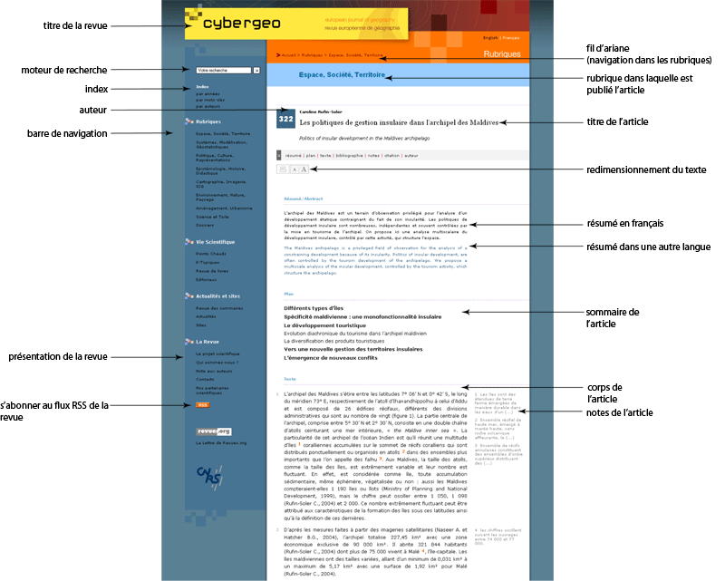

ACCÉDER À LODEL
------------------

Pour accéder à l’espace d’édition de son site, il faut inscrire dans la barre d’adresse du navigateur l’adresse du site suivie de
`/lodel/edition/`

Par exemple, **www.monsite.org/lodel/edition** donne accès à la page d’identification du site.

Autre solution : depuis le site en cliquant sur le lien « Lodel (accès réservé) », présent sur la plupart des sites.

Une identification est alors systématiquement demandée.

#### Page d’identification des utilisateurs

Insérer le nom d’utilisateur et le mot de passe transmis par l’administrateur du site, et validerAprès identification, la page de démarrage s’ouvre. Elle affiche la racine du site.

**Page d’accueil de l’interface d’édition d’un site sous Lodel**

Cet écran présente l’ensemble des fonctions d’édition proposées par Lodel.

À partir de cet écran, il est possible :
  * D’intégrer des documents dans les différentes publications du site,
  * De mettre en place la structure (ou l’arborescence) du site.
  
Cette page se divise en 2 parties : le bandeau supérieur de Lodel, et l’espace « édition ». Commençons par le bandeau supérieur.

**Bandeau supérieur de l’interface d’édition**

C’est grâce à lui que l’on peut naviguer dans l’espace Lodel. Tout en haut, à droite de la page, l’espace Lodel rappelle des informations générales : la revue sur laquelle on travaille (ici, revorg08), le nom d’utilisateur, ainsi que le niveau d’utilisateur (visiteur, éditeur, etc.). Enfin, deux boutons, sous l’espace d’identification : 

Permet de se déconnecter de l’espace de travail Lodel. Il est important de se déconnecter après chaque utilisation en cas d’utilisation d’un ordinateur partagé ou public, afin qu’aucun autre utilisateur ne puisse entrer et faire de modifications sur le site. 

Sert à réactualiser l’affichage en cas de modification des templates : l’ensemble des pages du site et de l’interface Lodel est recompilé en fonction des changements (la recompilation n’est accessible qu’au niveau administrateur). 

### LES ONGLETS DE NAVIGATION

Quelle que soit la position dans l’interface de Lodel, on aperçoit constamment, en haut à gauche de la page, les onglets : ce sont eux qui permettent de naviguer dans l’interface de Lodel 0.8. Voici le plan de cette interface, avec les menus et les sous-menus :

#### EDITION

  * Parcourir (racine)
  * Chercher (moteur de recherche simple)
  * Gérer les index
  * Gérer les index de personnes
  * Options du site
  
#### TABLEAU DE BORD

  * File d’attente (les documents en attente de publication)
  * Historique
  
#### INFORMATION

  * Statistiques
  * Descripteur de modèle éditorial
  * Informations techniques

#### SITE

  * Accès au site, en mode prévisualsation

#### ADMINISTRATION

  * Configuration (gestion des utilisateurs, administration des traductions du site…) 
  * Modèle éditorial (classes d’index, administration des options…) 
  * Outils (sauvegarde des données du site, langue de l’interface…)

Pour faciliter la navigation, deux couleurs sont utilisées dans les menus :

  * L’orange indique la rubrique dans laquelle on se trouve
  * Le bleu indique les autres rubriques
  
De même, dans les sous-menus :

  * Le jaune désigne le sous-menu actif
  * Le blanc désigne les autres sous-menus.

Dans l’exemple ci-dessus, l’utilisateur se trouve donc dans le menu d’édition ; et à l’intérieur de celui-ci, dans le sous-menu
« Parcourir ». C’est la « racine » du site, une page essentielle pour gérer les fonctions d’éditions de la publication.

Pendant la navigation côté site, deux « fils d’Ariane » permettent de se repérer aisément dans l’arborescence : le premier des fils d’Ariane permet de naviguer dans l’interface d’édition ; le deuxième, sur le site de la revue en mode prévisualisation. Ainsi, une double navigation est possible. On le voit sur cet exemple :

**Prévisualisation d’un article dans l’interface d’édition**

Et voici à présent la page web telle qu’elle se présentera à l’internaute :

**Visualisation côté site**

Attention cependant : cette présentation dépend en grande partie de la maquette du site pris pour exemple. D’autres présentations sont possibles.

----------------------------------------------------

### SIGNALÉTIQUE ET NAVIGATION DANS L'ESPACE D'ÉDITION

Les différentes pages de l’espace d’édition délivrent diverses informations au moyen d’icônes et d’intitulés, permettent de se déplacer dans l’arborescence du site et donnent accès aux boutons qui déclenchent des actions.

**Navigation dans l'espace d'édition**

Par exemple, dans cette page, on distingue plusieurs éléments se succédant du haut vers le bas

D’abord un fil d’Ariane, permettant de remonter vers le haut de l’arborescence de l’espace d’édition.

Puis une ligne indiquant le niveau où l’on se trouve. Ici, nous sommes dans un numéro intitulé : « L’analyse du discours au prisme de l’argumentation »

Puis un ligne de menus déroulants permettant de créer à ce niveau de nouveaux objets : de nouvelles publications, de nouveaux textes, textes simples fichiers ou sites. En déroulant le menu, on visualise les différents types d’objets que l’on peut créer à ce niveau.

Enfin, des intitulés textuels qui représentent les objets se trouvant à l’intérieur de ce numéro ; ici, des sous-parties et des articles. Lorsqu’ils sont cliquables, ils désignent des publications. Cliquer sur le lien permet d’ouvrir la publication pour visualiser ce qu’elle contient et « descendre » dans l’arborescence.

Si on examine maintenant plus en détail chacune des lignes composant cette arborescence, on voit :

Des pastilles de couleur : elles indiquent le statut de publication de l’objet : celui-ci peut être publié (verte), non publié (gris), brouillon (blanche à bordure grise), publié protégé (verte avec un cadenas). Les statuts de publication sont exposés plus en détail dans le chapitre « gérer un document ».

Viennent ensuite les icônes de type d’entités : ils permettent de distinguer d’un coup d’œil une collection, d’un numéro, d’une sous-partie, un article, ou un flux de syndication et ainsi de suite. Les types sont de toute manière indiqués en toutes lettres entre parenthèses à la suite de leur titre.

Les flèches vers le haut et le bas permettent d’ordonner comme on le souhaite la liste d’objets se trouvant à ce niveau de l’arborescence. A l’intérieur du numéro d’une revue par exemple, il permet de faire remonter ou descendre dans le sommaire les différents articles, afin d’obtenir, côté site, un sommaire ordonné comme on le souhaite.

Le bouton « éditer » permet d’accéder à l’ensemble des fonctions d’édition du document : les champs de métadonnées ainsi que les fonctions avancées d’ajout de documents annexes, ou de rechargement du document. Cette nouvelle page fera l’objet d’une description exhaustive dans le chapitre concernant le chargement d’un document.

Le bouton « voir » permet de prévisualiser le document tel qu’il apparaîtra sur le site public lorsqu’il sera publié.

Le bouton suivant permet de modifier le statut de publication du document, et le dernier bouton de le supprimer complètement de la base de données.

##### Droits d'auteur

© tous droits réservés
