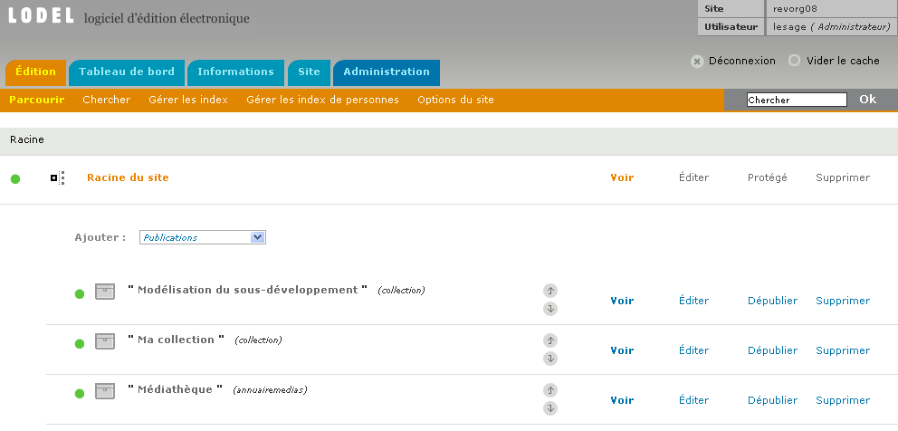

## ESPACE PUBLIC, ESPACE PRIVÉ

Système de publication en ligne intégré, Lodel offre à l’équipe éditoriale du site une interface d’édition lui permettant 
de créer, modifier, publier les contenus directement dans un navigateur Web. Ainsi, tout site Lodel comporte un espace privé,
accessible aux personnes autorisées uniquement, avec un login et mot de passe, donnant accès à cette interface.

Pour résumer : tout site Lodel se divise en deux :

D’un côté un site public, accessible à tous les lecteurs, dont l’apparence est particulière à chaque site et déterminée 
par les *templates*.

De l’autre un espace privé d’édition, conçu pour permettre aux personnes autorisées d’éditer le site. En général un lien 
présent sur les pages du site public permet d’y accéder. Si ce n’est pas le cas, il suffit de suffixer `/lodel/edition/`
à l’adresse du site pour pouvoir le trouver. Ainsi, si Mon Site se trouve à l’adresse http://www.monsite.org/, 
l’adresse de son espace privé sera http://www.monsite.org/lodel/edition/

Les deux espaces remplissent des fonctions très différentes :

   * L’espace privé permet aux utilisateurs enregistrés de charger, éditer,
     publier des contenus sur le site. C’est un **espace d’édition**.
   * L’espace public sert à diffuser de l’information vers les lecteurs,
     mais aussi les moteurs de recherche et autres outils qui indexeront le contenu du site. C’est un **espace de publication**.

##### ESPACE PUBLIC ET PRIVÉ

------------------------------------------

## LE MODÈLE DE DOCUMENT POUR LODEL

Lodel dispose d’une fonctionnalité de conversion de document par interfaçage avec un serveur Servoo qui assure la conversion des documents traitement de texte au format XML et XHTML. Pour que les documents au format traitement de texte soient correctement interprétés et convertis, ils doivent suivre des principes de structuration bien établis, c’est-à-dire utiliser des styles particuliers pour marquer le statut des différents éléments d’information qu’ils contiennent. 

Pour aider les équipes rédactionnelles dans leur travail de préparation des documents pour la conversion avec Lodel, il existe un modèle de documents, disponible pour MS Word et OpenOffice.org, contenant la liste des styles qui doivent être utilisés. Ces modèles de documents sont téléchargeables à partir du site http://www.lodel.org. 

Une fois téléchargés, il suffit de créer de nouveaux documents basés sur ces modèles, ou d’attacher des documents existants à ces modèles. Il reste à appliquer les styles appropriés sur le texte et ses métadonnées. Voir le chapitre « Préparer un document avec Word ».

-------------------------------------------

## LE MODÈLE ÉDITORIAL D'OPENEDITION JOURNALS

Lodel permet à l’administrateur d’un site de définir les entités – les objets éditoriaux – avec lesquels il souhaite travailler, d’en configurer la composition en terme de champs de base de données et d’en déterminer le comportement. Ce travail, relativement complexe, demande une bonne habitude de la publication sur le Web, une certaine expérience des bases de données relationnelles et une connaissance avancée de Lodel ! Pour cette raison, on peut choisir à l’installation du logiciel d’utiliser au choix deux modèles éditoriaux, dont l’un est en tous points similaires avec celui que le Cléo utilise pour son portail OpenEdition Journals. Parce qu’il est le plus fréquemment utilisé, ce modèle fait ici l’objet d’une présentation globale.

Le modèle éditorial de OpenEdition Journals repose sur l’utilisation pour l’essentiel de trois objets éditoriaux distincts :

* Les « publications » : il s’agit de purs contenants qu’il faut se représenter comme des boîtes, encastrables les unes dans les        autres autant que de besoin. Les publications peuvent être de différents types : collection (toujours à la racine du site), rubrique, numéro de revue, sous-partie, équipe, médiathèque, annuaire de sites
* Les « textes » : il s’agit des contenus longs et complexes qui sont publiés sur le site via les documents au format traitement de texte, chargés et convertis au moyen du Servoo. Les textes peuvent être des articles, des comptes rendus, des notes de lecture, des informations pratiques, des nouvelles, des chroniques
* Les « textes simples » sont des contenus courts et suffisamment simples pour être édités directement dans l’interface, sans passer par la conversion de document. Il existe un seul type dans le modèle OpenEdition Journals : les billets.

D’autres entités peuvent être utilisées dans ce modèle :

* Les « documents annexes ». Il peut s’agir d’images, de documents sonores, de vidéos, ou de tous types de fichiers, mais aussi de liens vers des sites web ou de commentaires attachés à des documents
* Les « personnes » : prenant la forme de « notices biographiques de membre », elles permettent de gérer un « annuaire d’équipe » dans le site Lodel
* Les « sites » : ils alimentent en général des annuaires de sites. On distingue les fiches de site des flux de syndication.

Ces différentes entités font l’objet d’un chapitre particulier de la documentation.

----------------------------------------------------

## LES NIVEAUX D'UTILISATEUR

L’accès à l’interface d’édition de Lodel est réservé aux utilisateurs disposant d’un login et d’un mot de passe. Lors de l’installation du site, un premier utilisateur est créé, qui dispose de tous les droits d’administration. Il s’agit de l’administrateur Lodel. Ce premier utilisateur a la possibilité de créer ensuite d’autres utilisateurs en leur attribuant des logins et mots de passe. Chacun d’eux aura donc un accès individuel et personnalisé à l’interface d’édition. Lodel permet en outre de leur attribuer des niveaux de droits différenciés.

#### POURQUOI 5 NIVEAUX ?

Dans le travail de création, de maintenance et de mise à jour d’un site, les manipulations à effectuer 
sont multiples : l’importation de documents, la publication de ces documents, la structuration du site, la maintenance des fichiers.

Il est rare que ces rôles soient tenus par une seule et même personne. Ainsi le secrétaire de rédaction sera chargé de l’importation des documents, le rédacteur en chef aura la responsabilité de la publication, et le webmestre devra s’occuper du travail sur les gabarits.

Cette distribution en niveaux d’utilisateurs permet de structurer efficacement des équipes dispersées géographiquement. Elle permet par ailleurs de répartir les rôles entre les différents acteurs de la vie d’une revue (auteur, rédacteur en chef, webmaster), dont les compétences ne sont pas les mêmes.

Ces différents rôles à jouer sur le site impliquent des différences de droits d’accès. Par exemple, la personne qui importe les documents n’a pas nécessairement l’autorité nécessaire pour publier ou dépublier les documents du site. Par conséquent, il est préférer que cette possibilité ne lui soit pas accordée. 

Les cinq niveaux d’utilisateur sont :

* Visiteur
* Rédacteur
* Editeur
* Administrateur
* Administrateur Lodel

Le statut de la personne connectée est rappelé en haut à droite de l’interface d’édition de Lodel.

#### Identification et statut de l’utilisateur dans le bandeau de l’interface d’édition

Les possibilités dont l’utilisateur dispose sous Lodel dépendent de son niveau. Il aura alors accès à une plus ou moins grande partie des fonctions de Lodel. Ces niveaux d’utilisateur sont définis par l’administrateur du site.

Quel que soit le niveau d’accès de l’utilisateur, les boutons correspondant aux actions non autorisées sont visibles, mais inactifs. Ainsi, tout utilisateur peut avoir un aperçu complet des fonctionnalités de Lodel, même s’il ne peut les utiliser directement.

#### QUE PERMET CHAQUE NIVEAU D'UTILISATEUR

**Visiteur**

C’est le premier statut, le plus restrictif. Il permet à la personne connectée à Lodel de naviguer au sein du site et de l’interface d’édition, mais aucune action ne lui est permise. Il ne peut avoir qu’un rôle de spectateur.

*Ce niveau d’accès peut par exemple être attribué aux membres du comité de rédaction d’une revue, ou aux auteurs, qui peuvent ainsi vérifier la bonne qualité formelle des  textes avant publication.*

**Rédacteur**

Le rédacteur peut ajouter des documents au site, en les important via l’interface de chargement.

Aucune autre action ne lui est permise : il ne peut ni publier les documents, ni les détruire.

*Ce niveau correspond par exemple au secrétaire de rédaction, qui n’a en charge que le stylage et l’importation des documents.*

**Editeur**

L’éditeur peut décider quel document doit être publié, dépublié, détruit.

Il peut aussi créer des publications, déplacer les documents d’une publication à l’autre. Il gère la structure éditoriale du site.

*Ce niveau correspond donc au statut de rédacteur en chef de la publication.*

**Administrateur**

Comme son nom l’indique, l’administrateur possède tous les droits. Il peut accéder à l’ensemble des fonctionnalités disponibles dans l’interface du site. Il gère l’ensemble du site, les différents utilisateurs, les options définies dans l’interface d’administration.

*Ce niveau correspond à celui du webmaster.*

**Administrateur de Lodel**

L’administrateur Lodel possède deux droits supplémentaires par rapport à l’administrateur simple :

  1. Il peut modifier le modèle éditorial du site
  2. Il peut circuler d’un site à l’autre, dans le cas des multisites.
  

## DROITS

© tous droits réservés
