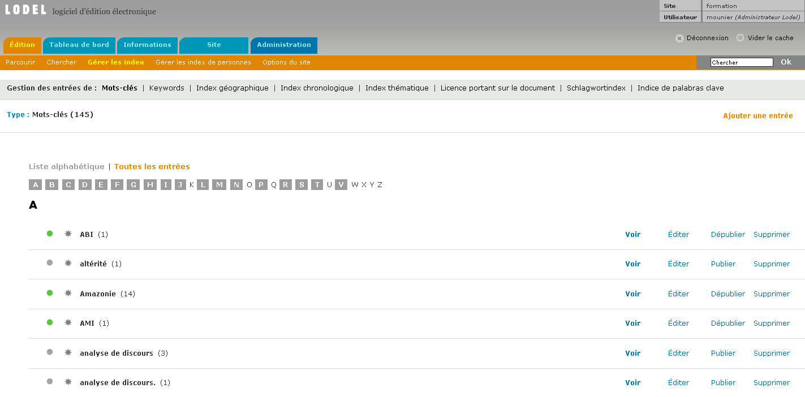
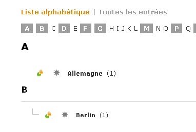
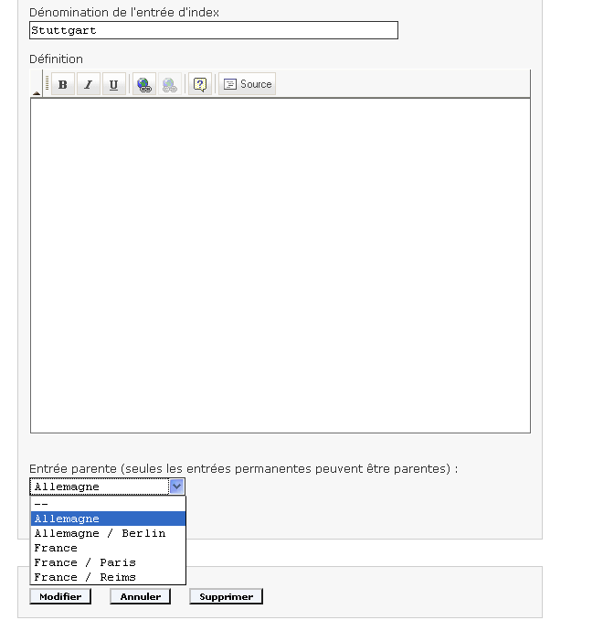
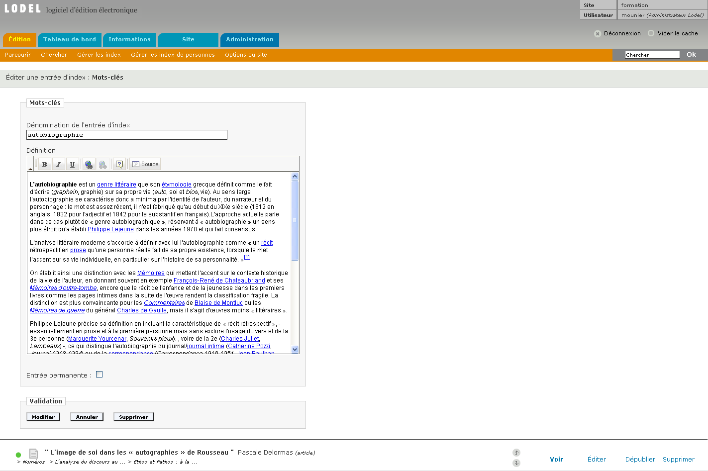

LES INDEX DU MODÈLE ÉDITORIAL DE REVUES.ORG

INDEX MATIÈRES

Lodel définit deux grands types d’index : les index linéaires et les index hiérarchiques. Les premiers se caractérisent par le fait que toutes les entrées d’index sont situées au même niveau. Les index hiérarchiques permettent en revanche de subordonner les entrées d’index les unes aux autres, autrement dit, de définir des entrées parentes et des entrées enfant, et ce, à n’importe quel niveau de profondeur.

Index linéaires : il s’agit de l’index mots clés et de ses variantes linguistiques : keywords, Schlagwortindex, indice de palabras claves. Attention : chaque index est autonome ; il n’existe pas de lien de traduction entre ces différents index.
Index hiérarchiques : il s’agit des index thématiques, chronologiques et géographiques. L’index géographique par exemple permet de définir des zones géographiques emboîtées (Europe>France>Marseille)
INDEX DE PERSONNES

Il s’agit de l’index des auteurs, des traducteurs, des directeurs de publication, des éditeurs scientifiques et des auteurs d’œuvres commentées.

Index auteurs : il s’agit des auteurs des documents mis en ligne. Attention : il est à noter que pour Lodel, contrairement à d’autres logiciels de publication, la notion d’auteur n’a aucune connexion avec la notion de compte utilisateur. Ainsi, lorsqu’un utilisateur charge un document dans Lodel, il n’est pas considéré comme l’auteur du document. Cette information est renseignée dans le document Word lui-même où le nom de l’auteur est précisé.
Index auteurs d’une œuvre commentée : dans le modèle éditorial de Revues.org, il est possible de publier des comptes rendus ou des notes de lecture. Pour ces documents, il est possible de spécifier certaines informations relatives à l’œuvre faisant l’objet du compte rendu ou de la note de lecture, telles que le nom de son auteur, ce qui permet de constituer et d’alimenter un index des auteurs des œuvres commentées par les comptes rendus et notes de lecture (à ne pas confondre avec l’index des auteurs des documents publiés sur le site).
Index des éditeurs scientifiques : il s’agit ici de l’éditeur scientifique d’un document particulier (un ancien article réédité par exemple et présenté par un chercheur) et non du responsable scientifique de tout un numéro de revue ou d’un dossier, c’est-à-dire d’une publication.
Index des directeurs de la publication : cet intitulé est trompeur car par « directeur de la publication » on ne désigne pas le responsable juridique du site dans son ensemble, contrairement à l’usage courant, mais les responsables de numéros et de dossiers, c'est-à-dire de « publications » au sens où Lodel l’entend (se reporter au glossaire pour plus de précision). Contrairement aux autres index, celui-ci n’est donc pas alimenté par le chargement de documents sur le site, mais par l’ajout de responsables au niveau des publications.
GESTION DES INDEX

CHARGEMENT DES ENTRÉES D’INDEX

Excepté l’index des directeurs de la publication, tous les index matières ou de personnes gérés par Lodel sont constitués d’entrées d’index liées à des documents. Lodel offre la possibilité d’alimenter ces index directement par l’ajout des entrées au niveau des fichiers au format traitement de texte chargés sur le site, ou via l’interface Web ; ou les deux. Il est cependant recommandé d’insérer les entrées d’index dans les fichiers au format traitement de texte, en leur appliquant les styles qui conviennent. En effet, si une entrée d’index a été attachée à un document via l’interface et qu’elle ne se trouve pas dans le fichier au format traitement de texte qui correspond à ce document, lorsque ce fichier sera rechargé par la suite, le lien avec l’entrée d’index sera perdu. Les informations contenues dans le fichier au format traitement de texte ont toujours la préséance sur celles qui sont indiquées dans l’interface Web.

Au moment du chargement du fichier, des champs particuliers sur la page d’édition du document permettent de vérifier que les bonnes entrées d’index ont été reconnues et ajoutées dans les index appropriés (voir le chapitre : « Importer un document »). Des pages de gestion d’index dans l’interface permettent enfin de visualiser les index dans leur globalité et d’y apporter éventuellement des modifications.

Page de gestion de l’index mots clés dans l’interface

LES ENTRÉES D’INDEX HIÉRARCHIQUES

Cas d’entrées hiérarchiques dans l’index géographique

Il est cependant un cas particulier où les entrées d’index doivent être obligatoirement modifiées dans l’interface Web après ajout via le chargement des fichiers au format traitement de texte. Il s’agit des entrées d’index hiérarchiques. Il n’est en effet pas possible d’indiquer la relation hiérarchique d’une entrée d’index avec une parente au niveau du fichier au format traitement de texte. Toute nouvelle entrée chargée via le fichier sera donc positionnée au plus haut niveau de l’arborescence (sans parent). Il est donc nécessaire dans un second temps, après chargement, de lui attribuer un parent dans l’interface web. Cette opération peut être effectuée avant le chargement, par la création a priori de l’ensemble des entrées d’un index hiérarchique et l’assignation de leurs relations hiérarchiques. Le chargement de documents contenant ces entrées d’index viendra simplement établir une relation entre ces entrées d’index préexistantes et les documents.

Gestion des entrées d’index hiérarchiques dans l’interface

Dans tous les cas il faut faire très attention à ne pas introduire de variation de forme ou de casse dans les entrées d’index (singulier/pluriel, majuscule/bas de casse) au risque d’introduire des doublons.

EDITION DES ENTRÉES D’INDEX MATIÈRES

Il est possible d’enrichir les entrées d’index matière en les éditant dans l’interface. Chaque entrée peut en effet être décrite par un titre (« dénomination ») mais aussi par une définition, dont le contenu peut être mis en forme au moyen d’une barre d’édition. La présence de ce champ permet d’utiliser l’index de mots clés ou l’index thématique comme un glossaire.

La case « entrée permanente » définit le comportement de l’entrée d’index en l’absence de tout document qui lui serait lié. Si l’entrée est permanente, elle demeure en ligne même si aucun document ne lui est lié, ce qui n’est pas le cas si elle n’est pas permanente. Très logiquement, une entrée créée dans l’interface est nécessairement permanente ; elle ne l’est pas forcément si elle a été créée au moment de l’importation d’un document. Dans le cas d’index hiérarchiques, une entrée d’index ne peut être parente que si elle est permanente. Ceci afin de ne pas avoir d’entrée enfant dont le parent aurait disparu, c'est-à-dire d’entrée orpheline.

Edition d’une entrée d’index

Notons enfin que les entrées d’index disposent de leur propre statut de publication : elles peuvent être publiées ou non. Attention à gérer de manière cohérente ces statuts de publication, en particulier dans le  cas d’index hiérarchiques.

