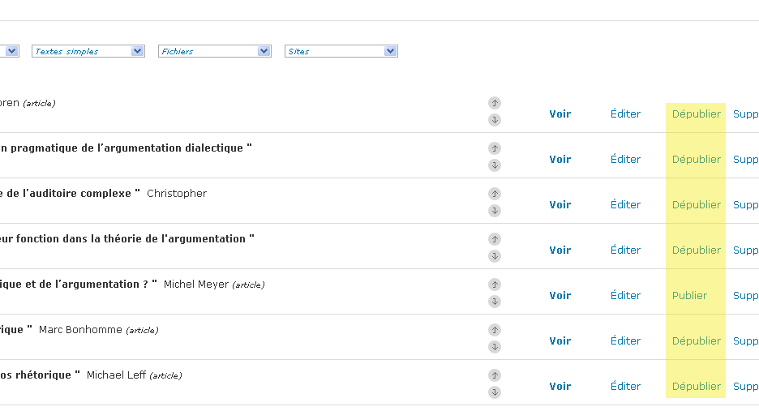
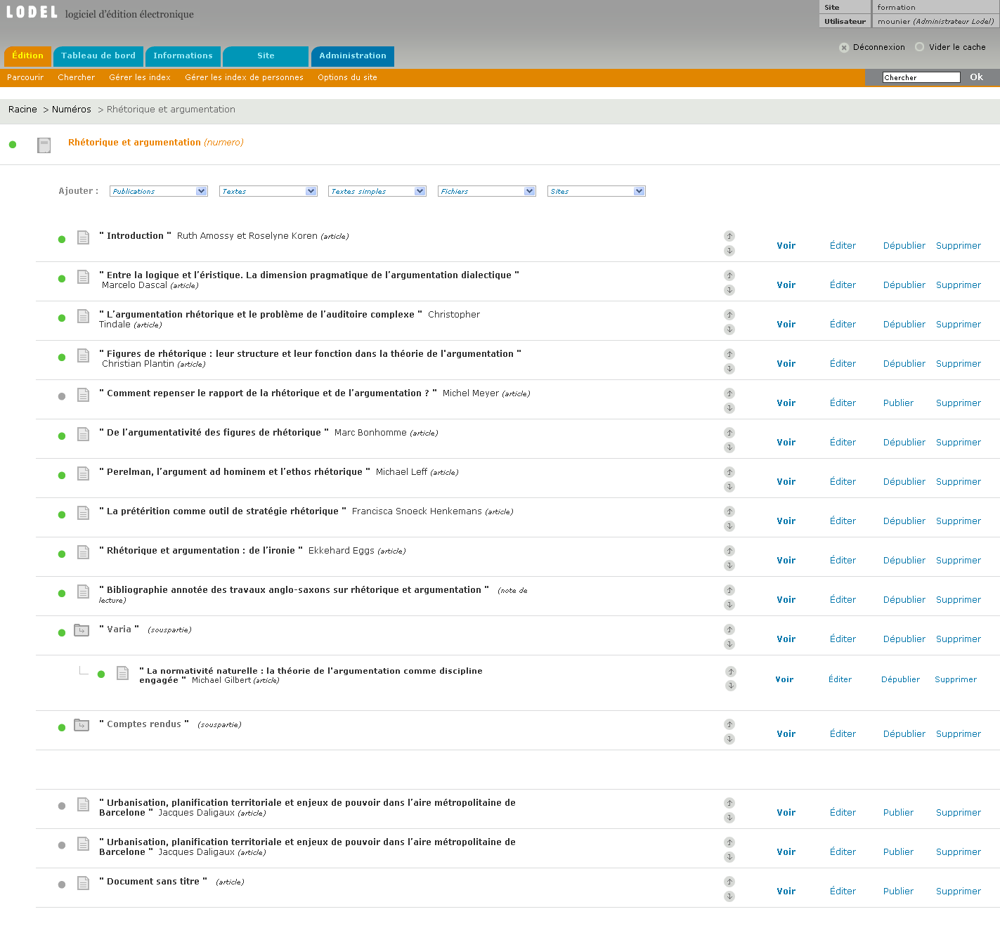
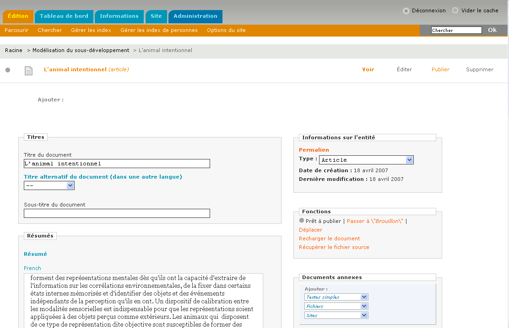
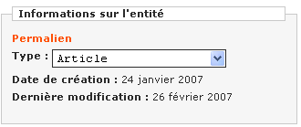
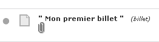
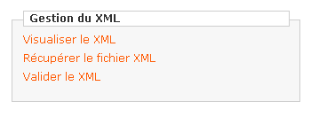

Avertissement : ce chapitre décrit les fonctions d’édition qui peuvent être appliquées aux documents ainsi qu’aux publications. Certaines de ces fonctions sont particulières à l’un ou l’autre de ces deux types d’objets.

LE STATUT DE PUBLICATION (DOCUMENTS ET PUBLICATIONS)
====================================================

Il existe deux principaux statuts de publication des documents et publications dans Lodel.

« Prêt à publier » : le document ou la publication n’est pas visible par l’internaute lorsqu’il navigue sur le site. En revanche, l’utilisateur de Lodel connecté peut le voir et, si son statut le lui permet, le travailler, le modifier.

« Publié » : dans ce cas, le document ou la publication est visible par tous les lecteurs sur le site.

Le statut de publication est modifiable sur la page de sommaire de la publication qui le contient.

Publication et dépublication d’un document

Chacun de ces deux statuts dispose d’un « double », faisant office de sécurité afin d’empêcher que le document ou la publication puisse passer d’un statut à l’autre trop facilement. Ainsi, le statut « brouillon » constitue une position de sécurité du statut « prêt à publier ». Un document placé en mode « brouillon » ne peut être publié en un clic. Pour le publier, il faut d’abord le passer en mode « prêt à publier », puis le publier.

A l’inverse, un document « publié », peut être « protégé ». Dans ce cas, il ne peut être dépublié facilement. Il faut d’abord le passe en mode « publié », puis le dépublier (ce qui est logique malgré les apparences).

La modification des statuts avancés de publication se fait sur la page d’édition des métadonnées du document, dans le bloc « Fonctions » de la colonne de droite.

Statuts avancés de publication d’un document

Les icônes associées aux statuts de publication

A chaque statut correspond une icône qui apparaît à côté du titre du document dans la publication.

Brouillon

 Prêt à publier (statut par défaut)

Publié

Publié protégé

Publication différée (voir le chapitre « Charger un document »)
A noter : lorsqu’un nouveau document est créé, il adopte le statut « prêt à publier » par défaut. Il appartient à l’utilisateur de le laisser en l’état, de le passer en mode brouillon s’il devra être repris avant publication, ou de le publier.

Les publications, comme les documents, reçoivent donc des statuts de publication. Lorsqu’une publication est publiée, tous les objets qu’elle contient, qu’il s’agisse d’autres publications ou de documents reçoivent le même statut de publication. Cela permet en particulier de préparer  par exemple un numéro de revue et de publier d’un coup tout le numéro avec tous ses articles le moment venu.

LES FONCTIONS D’ÉDITION DES DOCUMENTS ET PUBLICATIONS
=====================================================

FONCTIONS ACCESSIBLES À PARTIR DE LA PAGE DE SOMMAIRE DE LA PUBLICATION PARENTE
-------------------------------------------------------------------------------

Fonctions d’édition accessibles à partir de la page sommaire

Lorsqu'un document ou une publication a été mis en ligne, on peut lui appliquer les actions suivantes, dès la page de sommaire de la publication qui le contient :

Modifier l'ordre d’apparition dans le sommaire : les flèches verticales de changement d'ordre permettent de déplacer  le document auquel elles correspondent. On clique sur la flèche du haut pour remonter le document dans le sommaire, sur celle du bas pour le descendre. On peut ainsi déterminer facilement l’ordre d’apparition des documents dans les sommaires. Par exemple : l’ordre d’apparition des articles dans le sommaire d’un numéro de revue.
Voir : cette fonction permet de prévisualiser le document mis en ligne tel que le verra l'internaute. On peut ainsi se rendre compte de la qualité de l'importation et corriger certaines erreurs avant une publication définitive. Le double fil d'Ariane reste présent en haut de la page, ce qui permet de revenir rapidement aux fonctions d'édition du document, en revenant à la publication parente, ou en cliquant sur les boutons d'édition.
Editer : permet d'accéder à la page de métadonnées d'un document ou d'une publication. On peut modifier les métadonnées du document, attacher une icône, joindre un document annexe. (voir ci-dessous).
Publier/Dépublier : ce bouton permet de changer le statut de publication du document
Supprimer : permet de détruire un document ou une publication du site. Une confirmation est demandée par Lodel. La destruction est définitive. Toutes les données relatives au document détruit sont effacées de la base de données. Attention : la suppression d’une publication entraîne la destruction de toutes les publications et de tous les documents qu’elle contient. Cette action est donc à utiliser avec la plus grande prudence, et n'est accessible qu'au niveau éditeur pour la suppression des documents, et administrateurs pour la suppression des publications. Cette fonction ne doit pas être utilisée pour corriger des erreurs dans des documents déjà publiés (suppression puis re-création à partir du nouveau fichier) car l’adresse à laquelle ces documents sont accessibles est alors perdue. S’ils ont fait l’objet de citations dans d’autres publications, ils deviennent alors introuvables. Pour corriger des erreurs dans un document, il faut utiliser la fonction « Recharger » qui est spécialement conçue pour cela (voir plus bas).

LES FONCTIONS ACCESSIBLES SUR LA PAGE D’ÉDITION D’UN DOCUMENT OU D’UNE PUBLICATION
----------------------------------------------------------------------------------

Cette page permet d’effectuer de très nombreuses actions sur le document ou la publication.

La page d'édition des métadonnées : vue d'ensemble

Certains champs diffèrent selon qu’il s’agisse d’un document ou d’une publication, ou même selon le type de document qui est édité. Malgré tout, la page d’édition d’un document ou d’une publication se présente toujours avec deux colonnes :

La colonne de gauche présente les champs d’édition des métadonnées décrivant le document ou la publication. Une description exhaustive des champs de métadonnées d’un texte peut être trouvée dans le chapitre traitant du chargement d’un document avec Lodel.

La colonne de droite donne accès à des fonctions avancées d’édition du document ou de la publication. En voici une description complète.

Informations sur l’entité
-------------------------

Bloc « Informations sur l’entité »

Permet, grâce au menu déroulant, de modifier le type du document (éditorial, note de lecture…), mais dans la limite de la cohérence du modèle éditorial : un article ne peut être transformé en rubrique. Par contre, une rubrique peut devenir un numéro. Cette modification n’était pas possible dans la version 0.7 de Lodel. Il est à présent possible de transformer un éditorial en article, par exemple, sans avoir à détruire le document d’origine (ce qui obérait gravement sa citabilité).

Le « Permalien » permet de connaître, à l’avance, l’adresse finale du document. En cliquant sur l’intitulé, une fenêtre pop-up s’ouvre, et affiche l’adresse générée par Lodel. Les dates de création/modification sont générées automatiquement par Lodel ; on ne peut donc les modifier manuellement. Attention : il ne faut pas confondre ces dates avec la date de publication qui, elle, est modifiable. Ce champ se situe dans la colonne de gauche de la page d'édition des métadonnées.

Fonctions
---------

Bloc « Fonctions »

Permet de modifier le statut  de publication d’un document. Lorsqu’on modifie le statut d’un document, la modification opère tout de suite, sans confirmation. Si on a effectué des modifications dans la colonne de gauche de la page d’ « édition des données relatives à l’entité » (modification du titre, etc.), il faut valider avant de modifier le statut du document, faute de quoi les modifications seront perdues.

Il est aussi possible de déplacer un document dans l’arborescence documentaire du site. On peut aussi déplacer une publication ; dans ce cas toutes les publications et tous les documents qu’elle contient seront aussi déplacés.

C’est dans ce bloc que l’on trouve le bouton permettant de « Recharger le document », c'est-à-dire de charger à nouveau le fichier au format traitement de texte qui a permis de générer le document. Cette fonction permet d’appliquer sur le site des corrections qui auront pu être apportées au niveau du fichier source sans devoir détruire puis recréer le document. Lorsqu’on « recharge » le document, celui-ci conserve son identifiant ainsi que son adresse, ce qui évite d’en briser la citabilité. Attention toutefois, le nouveau fichier chargé via cette fonction « écrase » sans possibilité de retour la version précédente.

La fonction « Récupérer le fichier source » permet de télécharger sur son ordinateur personnel le fichier au format traitement de texte qui a servi à générer le document. En cas de rechargements multiples du document, c’est toujours le dernier fichier chargé qui est récupéré.  Les deux fonctions « Recharger » et « Récupérer » facilitent le travail collectif sur le site : tous les intervenants sur un site peuvent ainsi se donner pour consigne de toujours récupérer le fichier source sur le site, avant de le recharger avec des modifications éventuelles. Cela permet d’être sûr de toujours travailler sur la dernière version des fichiers au format traitement de texte.

Documents annexes
-----------------

Bloc « documents annexes »

Permet d’ajouter des documents de diverses natures : commentaire, image, vidéo, son, lien vers un site Web, qui seront annexés aux documents en cours d’édition. Dans Lodel, les documents annexes, contrairement aux documents, ne sont pas convertis ou ne font pas l’objet de traitements particuliers.

L’ajout d’un document annexe entraîne l’ouverture d’une nouvelle page permettant de décrire complètement le document annexe et, le cas échéant, de télécharger le fichier le constituant. Une fois que le document annexe est ajouté, un trombone apparaît sous le titre du document parent.

Icône marquant la présence d’un document annexe

En cliquant sur le trombone, on revient à la page d’édition du document annexe. Lorsque plusieurs documents annexes sont attachés à un document, on voit autant de trombones que de documents annexes. L’interface est volontairement sommaire à ce niveau : pour ne pas l’alourdir, Lodel 0.8 n’affiche pas les titres des documents annexes. Il faut donc laisser sa souris quelques instants au-dessus du trombone pour savoir quel trombone renvoie à quel document.

Il est à remarquer que les documents annexes ont leur propre statut de publication ; ils peuvent être « prêt à publié » ou « publié » indépendamment du statut du document auquel ils sont attachés. Si on conçoit bien qu’un document publié puisse avoir un ou plusieurs documents annexes prêts à publier, le contraire risque d’entraîner des dysfonctionnements dans l’interface publique du site, bien que rien ne l’empêche techniquement.

Pour plus de détails sur la gestion des documents annexes, voir le chapitre « Gérer les documents annexes ».

Gestion du XML
--------------

Bloc « gestion du XML »

Visualiser le XML : permet de voir le XML. Le comportement dépend du type de navigateur utilisé.

Récupérer le fichier XML : permet de télécharger le fichier XML sur son disque dur. Il existe par ailleurs une fonctionnalité de sauvegarde de la totalité des fichiers XML dans la zone administration.

Valider le XML : permet de lancer une validation du XML afin de s’assurer de sa conformité aux normes. Aucun fichier ne doit produire d'erreur.
