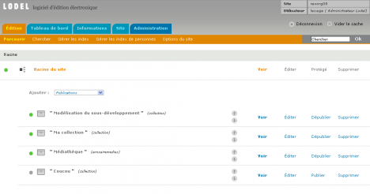
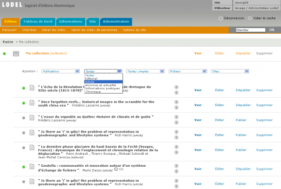
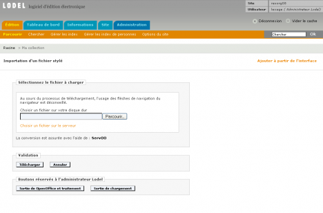
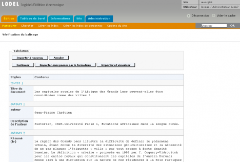
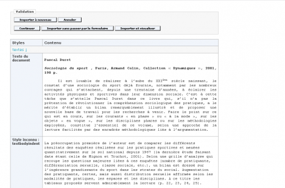
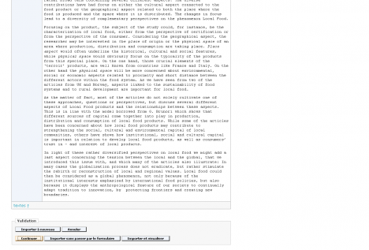
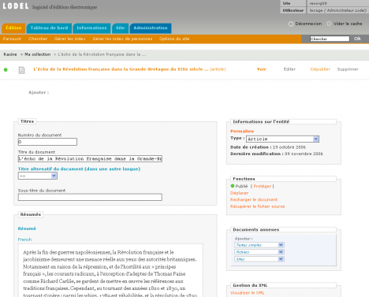
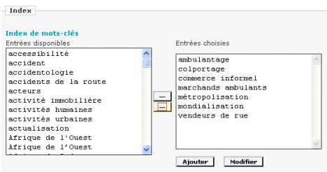

## AJOUTER UN DOCUMENT : TEXTES ET TEXTES SIMPLE

La création de documents avec Lodel peut suivre deux procédures tout à fait différentes.

* Le contenu de certains documents peut être directement saisi dans un formulaire détaillant différents champs, sur la page
« édition » du document. La mise en forme doit donc y être insérée manuellement, via l’utilisation d’une syntaxe de mise en forme de type « wiki », ou plus facilement en utilisant une barre d’édition « Wysiwyg » qui permet de voir directement à l’écran les mises en forme que l’on applique sur le texte. Cette procédure simplifiée concerne la création de « textes simples » dont le modèle éditorial d'OpenEdition Journals définit un seul type : « billet ».
* Dans le cas de documents longs, complexes, fortement structurés (plusieurs niveaux de titres, blocs de citations, notes de bas de page, tableaux, illustrations, mises en forme locales), il est préférable cependant de préparer son document à l’aide d’un logiciel de traitement de texte, puis de charger celui-ci dans Lodel en confiant au logiciel le soin d’effectuer la conversion.

En effet, les styles que l’on attribue à différentes parties de son texte avec un logiciel de traitement de texte (titre, sous-titre, auteur, normal, liste à puces, citation) sont reconnus par Lodel, qui les utilise pour remplir les champs de sa base de données et générer la structure XML correspondante. C’est par ce moyen qu’il pourra alimenter automatiquement ses différents index avec les informations pertinentes et affichera les différents éléments du texte de manière différenciée selon les instructions de la maquette.

Cependant, pour que Lodel mette correctement en page l’ensemble des données du document, et qu’il génère les métadonnées qui lui permettront d’être indexé, certaines règles doivent être respectées dans la préparation du document au moyen du logiciel de traitement de texte. C’est le « stylage » du document.

-----------------------------------------------------------

### PRÉPARER LE DOCUMENT À IMPORTER : LE STYLAGE

Avant d'importer un document de Lodel, il faut s'assurer que le document soit correctement stylé. Ce sont en effet les styles, définis par le logiciel de traitement de texte (MS Word, OpenOffice.org), qui vont permettre de définir la structure du document et renseigner les métadonnées, afin que le document soit correctement indexé.

Pour plus de précisions sur le stylage, voir le chapitre "[Préparer un document avec Word](http://lodel.org/417)".

-----------------------------------------------------------

### IMPORTER UN DOCUMENT AVEC LE SERVOO

##### LE FONCTIONNEMENT DE L'IMPORTATION

Dans le cas de documents préparés dans un traitement de texte, ceux-ci doivent être importés dans Lodel, qui les convertit aux formats XML et XHTML. Lodel utilise pour cela un serveur tiers appelé Servoo L’utilité de l’importation par la technologie Servoo est multiple :

* Ce serveur permet de convertir des documents issus de logiciels de traitement de texte (format .doc et .sxw) en documents structurés XML.
* Il est entièrement Unicode (jeu de caractères unifiant l’ensemble des langues du monde).
* Il permet de récupérer des images et tableaux, des notes de bas de page, des espaces insécables et des mises en forme locales.

Avertissement : avant de pouvoir convertir le premier document, il est nécessaire de configurer son site Lodel de manière qu’il puisse communiquer avec un serveur de conversion de documents Servoo. Cette opération de configuration est normalement du ressort de l’administrateur du site. On en retrouve le détail dans le chapitre de la documentation intitulé « Configurer son site ».

L’importation d’un document se fait en plusieurs étapes chronologiques. Ces étapes correspondent à différentes pages qui s’affichent successivement lors de l’opération : page de sélection du fichier, page de vérification du stylage, page de renseignement des métadonnées, et page de visualisation. C’est un processus peu complexe, mais pendant lequel il faut se montrer rigoureux.

#### 1ÈRE ÉTAPE : SÉLECTIONNER ET IMORTER LE FICHIER

Pour ajouter un document, il faut tout d’abord accéder à la publication dans laquelle on souhaite ajouter un document.

Il faut donc se rendre sur la page d’accueil de l’interface d’édition en cliquant sur l’onglet « Edition ».

**Page d'accueil de l'interface d'édition (le menu "Edition")**

On clique sur le titre de la publication dans laquelle on veut ajouter un document. Attention : il faut cliquer sur le titre de la publication, et non sur « Voir », qui  permet de prévisualiser la publication sélectionnée, non de l’éditer.

On accède alors à l’ensemble des documents contenus dans la rubrique. Pour ajouter un document dans cette rubrique, il faut utiliser les menus déroulants situés au-dessus de la liste des documents déjà publiés.

**Menus de création d’une entité dans Lodel**

On est alors envoyé sur la page d’importation du document : sélectionner le document sur le disque dur de son ordinateur, puis le télécharger dans Lodel.

**Téléchargement du document dans Lodel**

Un message annonce que le fichier est en cours de téléchargement. Il est quelquefois nécessaire de patienter plusieurs minutes, surtout si le document est très lourd. Une fois le fichier chargé, on accède à une nouvelle page : la vérification du balisage.

#### 2ÈME ÉTAPE : LA VÉRIFICATION DU BALISAGE

Cette étape permet de vérifier que tous les styles utilisés sont bien reconnus par Lodel.

**Page de vérification du balisage**

Chaque style est représenté par un bloc particulier. Le texte est représenté sous forme de tableau pour une meilleure vérification du balisage des données. Ce tableau est constitué de deux colonnes :

* À gauche, une colonne « Styles », qui indique les styles utilisés, et permet de détecter les erreurs
* À droite, une colonne « Contenu », qui affiche le texte du document.

La vérification du balisage et du texte doit être la plus complète possible : il faut vérifier que le texte est présent dans sa totalité, que les images, tableaux ont été reconnus, que les titres de parties ont été correctement identifiés. Le texte doit être intégralement contenu dans le tableau de vérification. La police de caractères utilisée par défaut lors de cette étape est la police Courrier, afin d’aider à la détection visuelle des mises en forme locales qui auraient échappé à la vigilance du styleur. Les styles citations, niveau de titre, titres et légendes d’illustrations apparaissent sous une forme différenciée du corps de texte, pour qu’on puisse les repérer.

Chaque bloc doit être correctement balisé. Si un paragraphe a été balisé avec un style inexistant, le message « Style inconnu » apparaît dans la colonne de gauche.

**Un exemple d'erreur de stylage reconnue par Lodel**

Il arrive que Lodel ne signale pas d’erreur, mais que le stylage soit incorrect malgré tout. C’est le cas, par exemple, lorsqu’on style un nom d’auteur avec le style « Titre », ou la description de l’auteur avec le style « Auteur ». Certains caractères apparaissent en grisé lorsqu’il s’agit de styles de caractère, ou pour les liens hypertexte.

Penser à vérifier également les noms des auteurs. Par exemple, avec des noms composés, vérifier que le nom et le prénom sont correctement différenciés. Vérifier les illustrations, leur ordre, la présence des titres et légendes. Lorsque le balisage n’est pas correct, cliquer sur le bouton « Abandonner », situé en bas et en haut de page. Puis corriger le document issu du traitement de texte situé sur l’ordinateur ; puis recommencer l’opération d’importation du fichier depuis la première étape, et reprendre la vérification.

Attention : pour annuler, ne pas revenir en arrière avec la flèche « Précédent » du navigateur, cela égarerait Lodel : utiliser impérativement le bouton « Annuler » de l’interface Lodel.

Si chaque bloc est correctement balisé, cliquer sur le bouton « Continuer », situé en haut ou en bas de page.

**Import d’un document : bouton « Continuer »**

#### 3ÈME ÉTAPE : VÉRIFIER LES MÉTADONNÉES SUR LA PAGE D'ÉDITION DU DOCUMENT

Cette page est essentielle dans le travail d’édition, car c’est par son intermédiaire que sont accessibles toutes les fonctions sur un document. Elle permet de vérifier les données du document que l’on désire mettre en ligne, et/ou d’y intégrer d’autres informations ; ou bien de modifier les informations sur le document lorsqu’il a déjà été importé.

On accède à cette page de deux façons : 

* Au cours du processus d’importation du document, après l’étape 2
* Depuis la page d’accueil de l’interface d’édition, en cliquant sur l’onglet « Editer », lorsqu’on veut modifier les données d’un document déjà importé.

**Renseignement des champs d’édition**

Les champs du formulaire d’édition ont été pré-remplis par Lodel à partir des informations qu’il a trouvées dans le fichier issu du traitement de texte. Dans la plupart des cas, ces champs sont éditables dans l’interface. Attention : Les informations insérées ici ne sont pas reportées au niveau du document au format traitement de texte et si celui-ci est rechargé, ces informations seront perdues. Il est donc préférable d’indiquer précisément les informations nécessaires dans le fichier issu du traitement de texte, quitte à le recharger après l’avoir complété.

Remarque : il est possible de configurer le modèle éditorial de manière à rendre ces champs non éditables dans l’interface ; ce qui permet d’éviter des erreurs malencontreuses.

On trouvera ci-dessous une description exhaustive des champs qui apparaissent lorsqu’on utilise le modèle éditorial d'OpenEdition Journals.

* **Numéro du document** : Il s’agit d’une information éditoriale qui peut être affichée dans la maquette dans la référence électronique du document. Le numéro de document peut être utilisé, par exemple, pour faciliter la citation des documents électroniques
* **Titre**
* **Titre alternatif** : on peut ajouter d’autres titres traduits dans l’interface en cliquant sur le menu déroulant et en choisissant une des langues disponibles
* **Sous-titre**
* **Résumés** : champ non éditable dans l’interface
* **Texte** : il s’agit d’un aperçu permettant de vérifier que le document n’est pas vide.
* **Texte au format PDF** : permet de charger le fac-similé de la version sur support papier du document. Ce champ peut faire l’objet d’un affichage particulier dans la maquette
* **Date de publication électronique** : si cette date n’est pas indiquée dans le fichier au format traitement de texte qui a été chargé dans Lodel, alors ce sera la date du jour qui sera prise comme référence (l’intitulé « today » apparaît dans le champ de la page d’édition des métadonnées). Il est par contre tout à fait possible d’indiquer une date de publication électronique postérieure à la date du jour. Cette manipulation permet en particulier de gérer « la barrière mobile » d’une revue diffusée sur support papier. En effet, entre le moment où un document est chargé et publié, et la date postérieure indiquée par sa date de publication électronique, seules les métadonnées du document sont accessibles. Les lecteurs ne peuvent accéder au texte intégral du document, et, si la maquette le prévoit, la date à laquelle ils pourront le faire leur est indiquée. Si l’option « Accès restreint » a été activée à partir de l’onglet d’administration du site, les abonnés auront accès au texte intégral de ces documents après avoir indiqué leur login et mot de passe.
* **Date de la publication sur papier** : valable uniquement pour les publications papier
* **Pagination du document sur le papier** : idem
* **Langue du document**
* **Licence portant sur le document** : permet d’indiquer quel régime de propriété intellectuelle s’applique au document : régime restrictif (tous droits réservés) ou licence libre (FDL, licence Art libre) ou licences Creative Commons.
* **Index** : pour chacun des index utilisés dans le site Lodel, on voit apparaître deux champs distincts. Le champ de gauche indique la liste des entrées d’index présentes au niveau de tout le site ; le champ de droite indique celles qui ont été chargées pour ce document à partir du fichier au format traitement de texte. Des flèches directionnelles permettent d’ajouter et d’enlever à ce niveau des entrées d’index pour le document en cours d’édition. Les boutons « Ajouter » et « Modifier », permettent de créer de nouvelles entrées d’index ou d’en modifier l’intitulé directement à ce niveau.

**Edition des entrées d’index au niveau du document**

* **Auteurs** : chacun des auteurs dispose de son propre bloc de champs où toutes les informations les concernant sont rassemblées (description, fonction, affiliation, courrier, site, nom, prénom). Attention : la description de l’auteur se trouve au-dessus de son nom et non dessous. Cet ordre particulier peut entraîner des confusions en cas d’auteurs multiples. Il est possible d’ajouter de nouveaux auteurs au niveau de l’interface en cliquant sur le bouton vert « Ajouter » ; et d’en supprimer en cliquant sur le bouton rouge « Supprimer ». Ce champ alimente l’index des auteurs.
* **Traducteur** : fonctionne comme un champ auteur. Aliment l’index des traducteurs.
* **Editeur scientifique** : idem. Pour une explication détaillée de ces fonctions, voir le chapitre « Préparer un document avec Word ». Alimente l’index des éditeurs scientifiques.
* **Œuvre commentée** : ce bloc de champs concerne des informations bibliographiques relatives à des comptes rendus et à des notes de lecture. Il s’agit ici des informations portant sur les ouvrages faisant l’objet du compte rendu : titre de l’œuvre, notice bibliographique, date de publication, nom de l’auteur (fonctionne comme un champ auteur classique, mais alimente l’index des auteurs d’œuvres commentées)
* **Gestion du document** : ce bloc est particulier au modèle éditorial d'OpenEdition Journals et renvoie à des exploitations spécifiques dans la maquette.
   * La case « document prioritaire » permet de mettre « à la Une » le document en cours d’édition sur une page de sommaire par exemple, à condition que la maquette le prenne en compte.
   * La case « document cliquable dans les sommaires » permet de faire en sorte que le titre d’un document ne soit pas cliquable dans le sommaire de la publication qui le contient. Cette fonction est utilisée lorsque le document ne possède ni texte intégral, ni métadonnées complètes. Cela peut être le cas par exemple d’un article qui sera publié dans un numéro à paraître, annoncé sur le site d’une revue, mais dont on ne connaît rien de plus que le titre et le nom de l’auteur. Il est dans ce cas inutile de conduire le lecteur vers une page quasiment vide qui ne lui donnera pas d’information supplémentaire par rapport à ce qu’il peut déjà voir au niveau du sommaire.

**Bloc de gestion du document**

#### 4ÈME ÉTAPE : VALIDER LES CERTIFICATIONS

Lorsque les champs ont été remplis, cliquer sur :

* « Terminer » pour confirmer les informations et revenir sur la page de la publication dans laquelle le document est placé
* « Terminer et visualiser » pour confirmer les informations et visualiser la page web. Le document est alors mis en ligne, mais non visible pour l’internaute. En effet, son statut de publication par défaut est « Prêt à être publié ». Il faut donc ensuite publier le document pour qu’il soit visible en ligne.
* « Annuler » pour annuler les modifications. Le processus d’importation et de mise en ligne du fichier est alors annulé.

#### Droits d'auteur

© tous droits réservés
