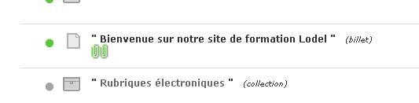
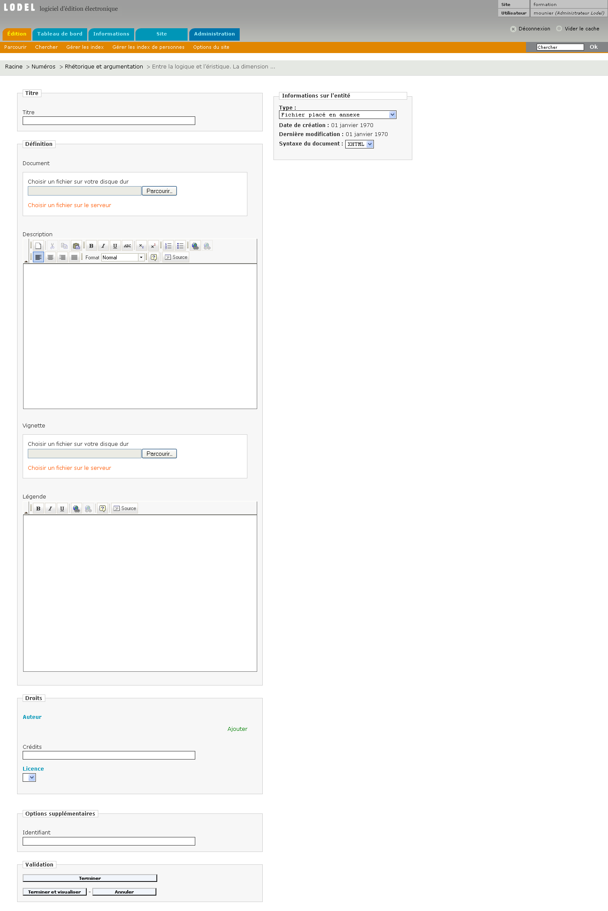

Une des particularités de Lodel, est sa capacité à prendre en charge la conversion des documents depuis un format traitement de texte (MS Word ou Open Office) vers le format de publication sur le Web XHTML. Pour que cette opération de conversion s’effectue correctement, il est nécessaire de structurer les informations contenues dans le document Word. Autrement dit, Lodel et Servoo, le logiciel tiers de conversion sur lequel il s’appuie, ne peuvent pas déduire la structure d’un document Word (quel est le titre, le sous-titre, les paragraphes de texte courant, de citation, les titres de parties et de sous-parties, les notes, la bibliographie ? ) si celle-ci n’est pas formellement indiquée dans le document.

Pour interpréter de manière correcte la structure d’un document Word, Lodel s’appuie sur la détection des styles qui se trouvent dans celui-ci. Par exemple, si le style « Titre » est appliqué à un paragraphe, Lodel comprendra qu’il s’agit du titre du document. Si c’est le style « Auteur », il comprendra qu’il s’agit du nom de l’auteur ; alors que le style « Citation » renvoie à un paragraphe de citation.

La procédure de préparation d’un document pour Lodel consiste donc, pour l’essentiel, à appliquer des styles définis sur les différentes parties du document. On appelle cette phase de travail le « stylage ». Cette méthode est relativement contraignante : Lodel comprend un nombre limité de styles et la présence dans le document de styles qu’il ne reconnaît pas entraîne des erreurs. Elle a cependant l’avantage d’assurer une prise en charge de la conversion  maîtrisée de documents longs et complexes sans nécessiter de connaissances techniques particulières de la part des utilisateurs.

Par ailleurs, cette méthode permet d’inclure dans le document au format traitement de texte la plupart des métadonnées qui le concernent : titre du document, sous-titre, résumé, mots clés en différentes langues, nom et description du ou des auteurs, date de publication, etc. Il permet donc de préparer des documents complets que l’on met en ligne une fois qu’ils sont prêts. Pour aider les utilisateurs dans ce travail de préparation, le Cléo a développé un modèle de document qui peut être utilisé dans la phase de stylage. Ce modèle de document correspond au modèle éditorial de Revues.org.

LE MODÈLE DE DOCUMENT DE REVUES.ORG
===================================

UN MODÈLE DE DOCUMENT : DÉFINITION
----------------------------------

Chaque document issu d’un traitement de texte est basé sur un modèle. Un modèle de document définit la structure de base d’un document et contient les paramètres du document, tels que les insertions automatiques, les polices, les affectations de touches, les macros, les menus, la mise en page, les mises en forme spéciales et, surtout, les styles. On parle quelquefois de « feuille de style » pour désigner un modèle de document. Cette appellation est impropre et il est déconseillé de l’utiliser car elle entraîne une confusion avec les feuilles de style CSS qui prennent en charge la mise en forme du texte sur le site Web.

Pour distinguer un document d’un modèle de document Word, on peut s’en référer  aux icônes désignant les deux types de fichiers

Icône d’un document Word 2002 sous Windows XP

Icône d’un modèle de document Word 2002 sous Windows XP

Ou, si l’on est utilisateur d’un système PC, aux extensions de nom de fichier : .doc pour un document, .dot pour un modèle de document.

De la même manière, un document et un modèle de document n’ont pas le même comportement ni les mêmes fonctions. Un document contient de l’information : il est créé, édité, modifié, enregistré. Un modèle de document n’est qu’un gabarit servant à générer des documents. Il permet de créer des documents basés sur lui.

Le modèle par défaut pour tout document Word est le modèle Normal.dot

Le Cléo a développé à l’intention des auteurs qui saisissent leurs textes sous Word un modèle de document, permettant de structurer leurs textes pour préparer leur traitement par Lodel.

Ce modèle intègre tous les styles utilisés dans le modèle éditorial de Revues.org.

LE MODÈLE DE DOCUMENT DE REVUES.ORG
-----------------------------------

Les styles contenus dans le modèle de documents de Revues.org sont, comme pour tous les modèles Word, listés par ordre alphabétique dans un menu de barre d’outils Mise en forme (on y accède par l’onglet « Format > Styles et mises en forme »).

Afin de faciliter l’accès à ces styles, ils sont proposés dans une barre d’outils spécifiques : la « barre d’outils Lodel », où ils sont organisés en cinq groupes, correspondant chacun à un menu :

Métadonnées Dublin Core
Métadonnées complémentaires
Texte
Plan
Œuvre commentée
Un sixième menu se contente de donner des informations sur le modèle lui-même.

Le modèle de documents de Revues.org : la barre de styles

INSTALLER ET UTILISER LE MODÈLE DE DOCUMENT
-------------------------------------------

Après avoir téléchargé et installé le modèle de document de Revues.org sur son ordinateur, on peut l’utiliser de deux manières :

On peut créer un nouveau document vierge basé sur ce modèle et y taper ou copier/coller son texte depuis un autre document. Pour ce faire, lorsqu’on utilise Windows, il suffit généralement de double-cliquer sur le modèle. Un nouveau document est alors créé ; on y voit apparaître le barre d’outils de stylage caractéristique du modèle Revues.org. Il suffit d’effacer le faux texte qui s’affiche dans le document, puis de taper ou coller son texte avant d’appliquer les styles utiles.

Nouveau document généré à partir du modèle de document Revues.org

Autre possibilité : si on dispose d’un document Word contenant déjà tout le contenu à mettre en ligne. Dans ce cas, on peut attacher a posteriori le modèle Revues.org à ce document. Pour ce faire, il faut ouvrir le document original, puis ouvrir le menu : Outils, puis Modèles et compléments. Le champ « attacher » permet alors d’aller chercher sur son disque dur puis d’attacher le modèle Revues.org. Avant de valider, il ne faut pas oublier de cocher la case « Mise à jour automatique des styles », faute de quoi l’attachement ne sera pas effectif. Après validation, la barre d’outils Revues.org apparaît.

Attacher le modèle de Revues.org

Il reste à appliquer les styles adéquats sur les bonnes parties du document.

STYLER UN DOCUMENT AVEC LE MODÈLE REVUES.ORG
============================================

AFFICHAGE DES STYLES DANS WORD
------------------------------

Pour utiliser de manière efficace le modèle de document dans Word, il est fortement conseillé d’afficher les styles dans une colonne à gauche du document.

Pour cela, dans la barre de menu « Outils », cliquer sur « Options », puis dans l’onglet « Affichage », en bas, régler la largeur de la zone de style à 3-4 cm.

Il suffit ensuite de sélectionner le mode d’affichage « Normal » (menu « Affichage, cliquer sur « Normal »).

Affichage des styles

RECOMMANDATIONS DE STYLAGE
--------------------------

La qualité du stylage est très importante pour la suite du chargement du document dans Lodel. Un stylage mal appliqué provoquera une erreur de présentation lors de la mise en ligne.

Stylage des métadonnées
-----------------------

Regrouper les métadonnées en début de texte suivant cet ordre si possible :

Titre (obligatoire)
Surtitre
Sous-titre
Auteur
Description de l’auteur
Droits Auteur
Traducteur
Editeur Scientifique
Langue
Titre de l’œuvre commentée
Auteur de l’œuvre commentée
Notice bibliographique de l’œuvre commentée
Date de publication de l’œuvre commentée
Résumé
Mots clés
Titre traduit (en)
Abstract
Keywords
Titre traduit (es)
Resumen
Palabrasclaves
Geographie
Periode
Numéro du document
Pagination
Date de publication
Date de publication papier
Notice bibliographique
Important : aucun paragraphe en style « Normal », « Note de la rédaction », ou autre, ne doit se trouver à l’intérieur du bloc des métadonnées (affichées en bleu dans le modèle de document). Si un paragraphe de style normal ou de corps de texte s’intercale entre deux paragraphes de métadonnées, l’importation échouera.

Certains styles possèdent des raccourcis clavier qui permettent une plus grande facilité d’utilisation. Ces raccourcis sont indiqués dans les menus déroulants du modèle.

Titre / sous-titre

Veiller à ce que le titre

soit placé en tout début de document ;

constitue un seul paragraphe, sans saut de ligne manuel ;

soit affiché en minuscules sauf initiale. Si le titre du document est entièrement en majuscules, il est possible dans Word de le faire basculer en minuscules en le sélectionnant et en appuyant sur [Maj.+F3] ;

ne soit pas terminé par un point.

Veiller à ce que le sous-titre

soit placé sous le titre ;

constitue un seul paragraphe, sans retour à la ligne ;

soit affiché en minuscule sauf initiale ;

ne soit pas terminé par un point.

Titres traduits

Pour les traductions, il est d’usage d’indiquer en titre le titre du document dans la langue de la traduction et d’indiquer le titre original avec le style « Title(en) », « titulo (es) »… Le style « Titre(fr) » permet d’indiquer le titre traduit de la traduction d’un article écrit originalement en français. Par exemple, la traduction anglaise d’un article français aura pour titre le titre anglais et pour titre traduit (fr) le titre français de l’article.

Auteur

Veiller à ce que :

l’auteur soit placé sous le titre (ou le sous-titre du document) ;

les prénom et nom soient affichés dans cet ordre et en minuscule sauf initiale. Cet ordre est important car Lodel va en déduire le prénom (premier mot) et le nom (deuxième mot) au moment de l’importation.

Si le document est signé de plusieurs auteurs sans précision institutionnelle :

mentionner les auteurs sur une même ligne en les séparant par des virgules ;

supprimer toute ponctuation ou tout terme autre que les noms d’auteurs (notamment la conjonction « et » ou l’éperluette &).

Si chaque auteur est accompagné de la mention de son institution :

placer chaque auteur en un paragraphe unique, suivi d’un paragraphe stylé en « Description auteur » comme dans l’exemple qui suit :

Marin Dacos

Ecole des hautes études en sciences sociales, Paris

Pierre Mounier

ENS-LSH, Lyon

Le paragraphe stylé en « Description auteur » peut contenir les styles de caractères suivants :

Affiliation
Fonction
Préfixe
Courriel
Site
Chacun des ces styles sera interprété par Lodel dans un champ distinct et permettra un affichage standardisé dans la maquette.

Orthographe des noms d’auteur

Il est indispensable d’utiliser toujours la même forme pour les noms d’auteurs.  En particulier, prêter attention à la casse, et à l’orthographe des prénoms.  Ex : Si deux documents d’un même auteur sont importés dans Lodel , l’auteur étant orthographié Jean-Paul Durand dans le premier document, et Jean Paul Durand (sans tiret) dans le second, Lodel les considérera comme deux auteurs différents, et créera deux entrées distinctes dans l’index des auteurs.

Traducteur

Si le document à publier est une traduction, styler en « Traducteur » les prénom et nom du traducteur (utiliser les mêmes règles d’écriture que celles utilisées pour les noms d’auteurs).

Le style « Traducteur » doit être utilisé uniquement pour les prénom et nom du traducteur. Les autres informations concernant la traduction (Ex. : « Cet article est traduit de l’anglais par Jean-Paul Durand ») peuvent être placés dans le texte et stylés en « Notes de la rédaction » ?

Résumé, Abstract, Resumen, Riassunto…

Veiller à ce que

le(s) résumé(s) soi(en)t placé(s) sous l’auteur et sa description ;

la mention « Résumé » ou « Abstract » qui précède souvent le résumé de l’article soit supprimée ;

le(s) résumé(s) ne répète(nt) pas le titre de l’article, ni l’auteur. Cela représenterait un doublon avec le titre du document stylé au-dessus ;

les résumés en d’autres langues soient placés les uns en dessous des autres ;

le style appliqué corresponde bien à la langue du résumé : abstract pour un résumé en anglais, Resumen pour un résumé en espagnol…

Mots Clés, keywords et Palabras claves

Veiller à

retirer la mention « Mots clés » ou « Keywords » qui précède souvent la liste des mots clés ;

séparer les mots clés par des virgules ;

supprimer le point final éventuel à la fin la liste des mots clés. Ce point sera interprété par Lodel comme faisant partie du mot et une nouvelle entrée dans l’index des mots clés sera créée ;

supprimer tout autre élément séparant les mots clés, comme un tiret, un point virgule… ;

supprimer la majuscule à l’initiale des noms communs.

Orthographe des mots clés

Comme pour les noms d’auteurs, l’orthographe et la casse des mots clés doivent toujours être les mêmes afin d’éviter les doublons dans les index.

Date de publication papier / électronique

On distingue la date de publication papier et la date de publication électronique d’un document.

La date de publication papier peut être renseignée lors du stylage. Elle doit être présentée ainsi : 05/12/2005 ou  5 décembre 2005.

Si la date de publication électronique n’est pas indiquée dans le document, elle sera automatiquement renseignée par Lodel lors de l’importation du document et fixée au jour de l’importation du document. En cas de rechargement du document dans Lodel, si la date de publication électronique n’est pas indiquée dans le document elle sera fixée automatiquement au jour du rechargement du document.

Afin de conserver une date de publication électronique stable, même en cas de rechargement du document, il est donc nécessaire de l’indiquer dans le document de traitement de texte.

Date de publication électronique et « barrière mobile ».

Pour les revues adhérant à Revues.org et utilisant la fonction de « barrière mobile », la date de publication électronique sera utilisée par Lodel pour gérer l’affichage de l’article sous forme de résumé ou en texte intégral.

Les articles ayant une date de publication électronique postérieure à la date de consultation de l’article, seules les métadonnées seront affichés (titre, auteur, résumés, abstract…) ;

les articles ayant une date de publication électronique antérieure à la date de consultation de l’article seront affichés en texte intégral.

Pour une « barrière mobile » de deux ans, la date de publication électronique devra être fixée deux après la date de publication papier. L’article sera ainsi accessible en texte intégral deux ans après sa parution dans la revue papier.

Langue

Par défaut, lors de l’importation dans Lodel, la langue du document est le français.

Pour toute autre langue il importe de déclarer la langue du document, en spécifiant dans les métadonnées l’abréviation correspondant à ladite langue, disponible en annexe. Attention à ne pas mettre de majuscule sur la première lettre de l’abréviation (cas fréquent résultant de la correction automatique dans Word).

Pagination

La pagination papier d’un document peut être renseignée de différentes  façons : en chiffres romains et petites capitales (V-XXV), en chiffres arabes (5-25). On indique la pagination sans les mentions p. ou pp., celles-ci étant généralement prises en charge par la maquette.

Numéro du document

Il doit être indiqué en chiffre arabe et stylé en « numéro de document ». Il s’agit d’une information éditoriale qui peut être affichée dans la maquette dans la référence électronique du document. Le numéro de document peut être utilisé, par exemple, pour faciliter la citation des documents électroniques.

Fichiers particuliers : notes de lecture et comptes rendus d’ouvrages

Ils sont à styler séparément en autant de fichiers. Ne pas intituler ce type de document « Note de lecture ».

Si la recension n’a pas de titre propre, il est d’usage d’appliquer le style « Titre » à l’auteur et au titre de l’ouvrage recensé. Il est aussi possible de styler les éléments bibliographiques (éditeur, lieu et année d’édition…) en « Sous-titre » : ceci permet d’afficher la notice bibliographique dans le sommaire.

Les titre, nom d’auteur, notice bibliographique et date de publication des œuvres commentées peuvent aussi être stylés en tant que métadonnées (Menu Lodel œuvre commentée) dans cet ordre :

Titre de l’œuvre commentée
Auteur de l’œuvre commentée
Notice bibliographique de l’œuvre commentée
Date de publication de l’œuvre commentée
Ces informations permettront un meilleur référencement et donneront la possibilité de créer des index spécifiques (index des auteurs des œuvres commentées par exemple). L’affichage de ces informations dans la maquette peut aussi être prévu.

Ces indications ne remplacent pas le titre du document. Il est nécessaire d’indiquer ce dernier, même s’il reprend les éléments indiqués par les styles « œuvre commentée ».

Stylage du texte
----------------

Normal

Permet de styler tous les paragraphes de corps de texte, qui ne correspondent pas à un élément remarquable.

Lors du stylage des paragraphes en « Normal », vérifier que :

les italiques, petites majuscules, caractères en exposant sont bien conservés ;

le document ne contient pas de mise en forme locale

Titre n et Section n

Veiller à ce que les différents intertitres :

soient en minuscules sauf initiale ;

se suivent hiérarchiquement : ne pas utiliser le style « Titre 3 » alors que les titres de niveaux 1 et 2 n’ont pas été utilisés précédemment dans le document.

Listes à puces

Le style « Liste à puces » permet de mettre en forme des listes non numérotées. L’utilisation de ce style nécessite :

D’enlever les éventuels tirets en début de proposition ;

) pour les retours à la ligne à l’intérieur d’une proposition de la liste.
Poèmes, citations, listes

Pour présenter les poèmes, citations, listes, etc., remplacer les sauts de paragraphes (¶) par des sauts de ligne manuels (), [Maj + Entrée]. Ceci évite un espace trop important entre les lignes. Cet espace est défini dans la maquette du site.

Epigraphe

Ce style s’applique à une citation placée en début de texte.

Citation, citation bis, citation ter

Ces trois styles de citation permettent de différencier plusieurs types de citation. Ils seront affichés sous différentes formes dans la maquette.

Code

Le style « code » permet d’afficher du code informatique (html par exemple) sans que celui-ci soit interprété par le navigateur. Si le code html est stylé en « normal », celui-ci ne sera pas affiché mais interprété en tant que code html.

Les liens hypertextes

Les liens hypertextes reconnus dans le logiciel de traitement de texte sont récupérés par Lodel de même que les liens vers les adresses électroniques. Si le lien n’est pas actif dans le traitement de texte (il est généralement souligné en bleu lorsqu’il est actif), il faut renseigner l’adresse de destination (dans Word : clic droit + lien hypertexte).

Les images (figures, graphiques)

Les images sont conservées et récupérées par Lodel à condition qu’elles soient intégrées dans le corps du texte par Word. Les images (figures et graphiques) seront insérées dans un paragraphe stylé en « Normal » et seront récupérées telles quelles.

Les images peuvent être disposées en habillage ou sans habillage par rapport au texte.

Attention : Hormis pour les revues adhérentes de Revues.org, Lodel ne prend pas en compte les redimensionnements éventuels des images dans le fichier Word. Lodel affiche les images dans leur taille réelle. Réduire la taille d’une image par un redimensionnement avec la souris ne suffit donc pas : il faut utiliser un logiciel de traitement d’images avant de les importer dans Word ou OpenOffice.org et réduire :

la taille de l’image, en déterminant la hauteur et la largeur en pixels. La taille de l’image doit être raisonnable, afin de s’insérer correctement dans la maquette du site (en général, la zone d’affichage des images a une largeur de 500pixels). Il existe des exceptions : voir ci-dessous le paragraphe sur le redimensionnement des images par Lodel ;

la résolution de l’image, en appliquant à l’image une résolution de 72 pixels/pouces ;

le format de l’image doit être choisi avec précaution. Choisir le format (jpeg, png, gif) qui propose le plus faible poids d’image tout en conservant une qualité graphique. 
- Généralement, le format jpg est utilisé pour les images, photos, peintures contenant beaucoup de dégradés ;
- Le format gif est utilisé pour les images contenant des aplats de couleurs, et peu de dégradés (illustrations, dessins…) ;
- Le format png permet de compresser tous les types d’images et conserve une bonne qualité. Le poids d’un fichier png est cependant plus important que pour un fichier au format gif ou jpg. Il peut être utilisé pour les documents contenant peu d’illustrations. Pour un document contenant beaucoup d’images, il est préférable d’utiliser des images au format gif ou jpg afin de réduire le poids total du document. Il est déconseillé d’utiliser le format png pour des images contenant des zones de transparence car ces zones seront mal interprétées par certains navigateurs et perdront leur transparence.

Pour l’édition électronique, les images couleurs au format jpg et png doivent être en mode RVB et non en mode CMJN (utilisé pour l’impression).

Redimensionnement des images par Lodel (fonction disponible pour les revues adhérant à Revues.org)

Il est parfois nécessaire d’importer des images de taille supérieure à la largeur du texte dans la maquette (les cartes nécessitent par exemple une résolution importante pour être lisibles). Dans ce cas, Lodel génère automatiquement une image plus petite qui s’intègre dans la maquette. Cette image est alors cliquable et une icône « loupe » est ajoutée à droite de l’image. Le lien ouvre une nouvelle fenêtre qui contient l’image dans sa taille originale.

Titres, légendes et crédits des illustrations

Le sens de lecture d’un article sur internet est différent d’un article papier dans la mesure où l’internaute ne dispose pas d’une vue d’ensemble de la double page, mais lit l’article de haut en bas. Pour que le titre d’une illustration soit lu avant celle-ci, le titre de l’illustration (style « Titre Illustration ») doit être placé au dessus de l’illustration (style « normal »), la légende (style « Légende Illustration ») et les crédits (style « Crédits Illustration ») étant placés au dessous.

L’ordre Titre de l’illustration, illustration, légende de l’illustration et crédits doit être respecté pour que Lodel les associe correctement, notamment pour la fonction de redimensionnement des images. Aucune de ces mentions n’est techniquement obligatoire, mais il est recommandé de les renseigner.

Tableaux

Lodel gère les tableaux complexes, récupère les mises en forme de fond de cellule, fusion des cellules ou colonnes. Il faut que le tableau soit stylé en « Normal ».

Les tableaux ne doivent pas être disposés en habillage (avec du texte autour), sinon ils ne seront pas affichés par Lodel. Ils ne doivent pas contenir de saut de paragraphe dans les cellules.

Les styles « Titre illustration » et « Légende illustration » doivent être utilisés pour indiquer les titre et légende des tableaux.

Annexes

Les paragraphes stylés en « Annexe » apparaîtront en annexe de l’article. Il est aussi possible de joindre des documents annexes sous forme de fichiers indépendants de l’article dans l’interface d’édition de Lodel.

Bibliographie

La bibliographie doit être ajoutée en fin de document. Elle doit être stylée en « Bibliographie » et doit comporter un paragraphe par référence. Il ne faut pas indiquer le titre « Bibliographie » en début de Bibliographie, celui-ci étant affiché dans la maquette. En revanche, elle peut comporter des intertitres qui doivent être stylés en « Titre 1 », « Titre 2 », etc.

Cas particuliers

Formules mathématiques

Pour afficher une formule mathématique dans le corps de texte d’un document ou dans les notes, l’insérer en mode image.

Dans Word, sélectionner la formule, la copier et faire un collage spécial en mode point.

Diagrammes et graphiques

Ces éléments doivent aussi être insérés dans le document en mode image.

Les notes de bas de page

Veiller à 

supprimer les sauts de paragraphes au sein d’une même note de bas de page et à les remplacer par des sauts de ligne manuels. Lodel ne récupère qu’un paragraphe par note : si une note en contient plusieurs, seul le premier paragraphe sera affiché.

ce que le style des notes soit correct. Il arrive que le style « Note de bas de page » soit remplacé par une style « Note de bas de page Car » qu’il faut corriger.

la conservation des italiques, petites capitales et exposants.

ce que les appels de notes soient stylés en « Appel de note de bas de p. » ou « Normal ».

ce que les appels de notes ne contiennent pas de mise en forme locale (ex : « Appel de note de bas de p.+9pt+Arial »). Pour cela il suffit de sélectionner un appel de note et de vérifier dans la fenêtre de style si une mise en forme locale est présente. Si c’est le cas, il faut aller dans Format>Styles et mises en forme, et sélectionner dans la liste des styles le style des appels de note et le renommer en supprimant la mise en forme locale.

Lodel reconnaît différents types de notes : notes de bas de page, de fin de document, notes littérales, en chiffre romain… Il est conseillé de faire le choix d’un type de note pour l’ensemble des documents d’un site. Pour convertir les notes de fin de document en notes de bas de page, placer le pointeur dans le bloc de notes, et par un clic droit, sélectionner « Options de notes » ou « Convertir en notes de… ».

Documents annexes
-----------------

Précis de stylage. Lodel 0.8 <http://lodel.org/668?file=1>
